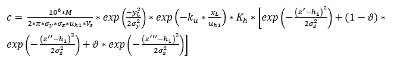

# Open SYMOS for QGIS 3

Open SYMOS plugin allows users to calculate year average, or maximum short-term concentrations of the selected pollutant based on information on point sources of pollution, wind rose and terrain. The result is a point layer of receptors with calculated immission values. The treatment of linear and areal sources of pollution has not yet been included in the model. The calculation model is based on the Sutton model of the Gaussian statistical plume model.

Basic formula for concentration calculation is:



where:
* c – pollution concentration (µg m<sup>-3</sup>)
* M - pollutant emission rate (g s<sup>−1</sup>),
* σ<sub>y</sub>,σ<sub>z</sub> – vertical and horizontal dispersion parameters (m),
* u<sub>h1</sub> - wind speed at corrected top of pollution source (m s<sup>-1</sup>) ,
* V<sub>s</sub> – volume flow of exhaust gases/fumes recalculated to normal condition (0 °C, 101325 Pa) (N m<sup>3</sup> s<sup>-1</sup>),
* y<sub>L</sub> – distance of the receptor from source pollution in perpendicular direction to wind direction (m),
* x<sub>L</sub> – distance of the receptor from source pollution in wind direction (m),
* k<sub>u</sub> – reduction coefficient caused by wet and draw deposition and chemical transformations (s<sup>-1</sup>),
* K<sub>h</sub> - reduction coefficient caused by influence of low sources to receptors at high elevation (-),
* h<sub>1</sub> - corrected height of pollution source (m),
* z<sup>'</sup>- corrected elevation of receptor for direct dispersion (m),
* z<sup>''</sup> - corrected elevation of receptor for lower reflection (m),
* z<sup>'''</sup> - corrected elevation of receptor for upper reflection (m),
* ϑ – coefficient for undulating terrain (-).

Settings of input data and their parameters is solved via browsing and filling in individual cards from left to right. The user can set the following options.

## Tab Settings
The selection of pollutant (SO<sub>2</sub>, NO, NO<sub>2</sub>, N<sub>2</sub>O, CO, CO<sub>2</sub>, NH<sub>3</sub>, CS<sub>2</sub>, HCl, H<sub>2</sub>O<sub>2</sub>, C<sub>2</sub>H<sub>6</sub>S, CH<sub>2</sub>O, CH<sub>4</sub>, CH<sub>3</sub>Cl, COS, Higher hydrocarbons, PM10), health limit of selected pollutant and description of modelling project.

## Tab Sources
The selection of the layer loaded into QGIS (or created in QGIS) containing source representation and its attributes. Only Point source is available up-to-date.

## Tab Terrain 

The selection of the layer loaded into QGIS (or created in QGIS) containing raster terrain representation.
## Tab Receptors 

The selection of the layer loaded into QGIS (or created in QGIS) containing receptors representation. Only Import receptors from layer is available up-to-date.
## Tab Wind rose
The selection of the (XML) file containing wind rose values. The modelling methodology except using wind rose summarized in 3 categories wind speed and 5 categories of atmospheric stability. The example of wind rose file is part of the sample data (at GitHub project).

## Tab Calculation
The selection of the type of calculation and preview of information about the status and settings of the calculation.

The result of the modelling is a new point layer of receptors with the pollutant concentration attribute. This is automatically loaded on the QGIS project.

There are some inactive controls in the GUI, like for importing line and polygon sources or generating receptors around the sources. This functionality was mostly already created. The codes are available in GitHub project repository. But they were not bound to controls and debugged. The project is still in progress. However, the basic functions for point source pollution calculations are already completely functional.

# Pack for release

```bash
rm qgis_open_symos_3_0.1.1.zip
zip -r qgis_open_symos_3_0.1.1.zip qgis_opensymos_3/ --exclude qgis_opensymos_3/.idea/\* --exclude qgis_opensymos_3/.git/\* --exclude qgis_opensymos_3/__pycache__/\*
```
